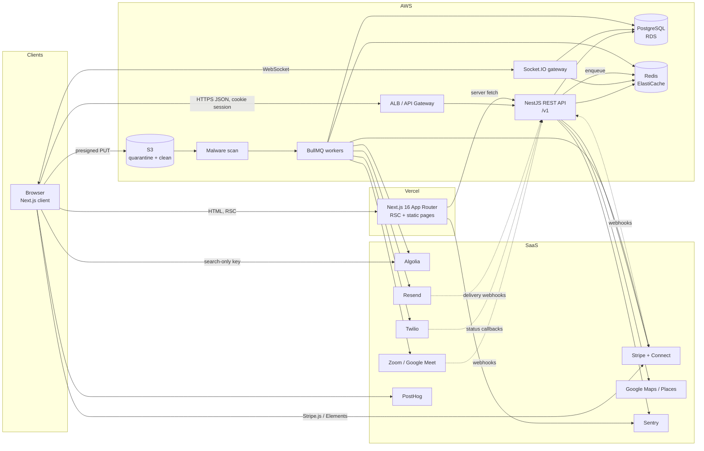
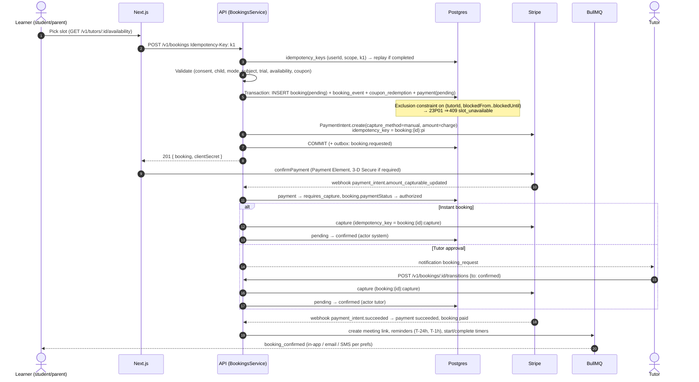
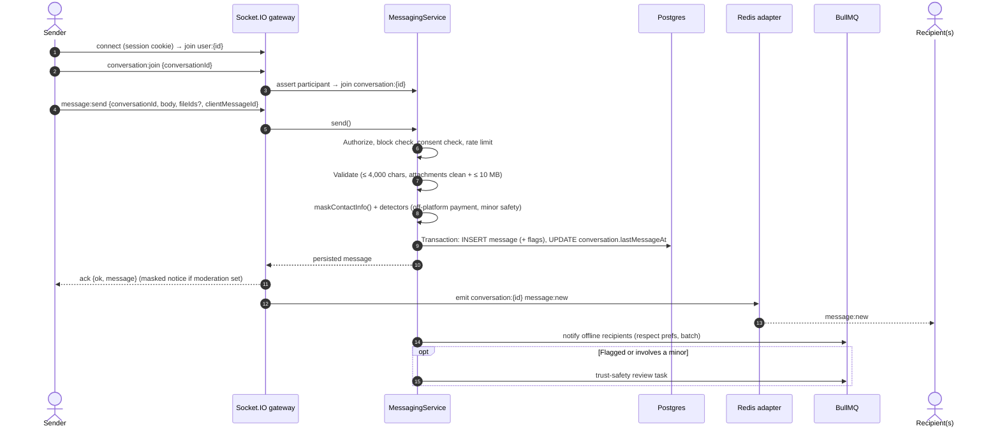

# TutorLink architecture

TutorLink is a US tutoring marketplace. Students, parents and tutors find each other, message, book and pay for online or in-person lessons, and track learning progress. Administrators and support staff run verification, trust & safety, payments and content.

This document describes **what exists today (the preview build)** and **the production system it is designed to become**. Companion documents:

| Doc | Contents |
|---|---|
| [ROUTES.md](ROUTES.md) | Every page and route, audience, status, rendering |
| [API.md](API.md) | REST `/v1` design, WebSocket events, permission matrix |
| [STATE_MACHINES.md](STATE_MACHINES.md) | Booking, requirement, application, verification, dispute, payment, payout lifecycles |
| [DESIGN_SYSTEM.md](DESIGN_SYSTEM.md) | Tokens, type, motion, components, accessibility |
| [DECISIONS.md](DECISIONS.md) | Defaults awaiting product-owner approval |
| [ROADMAP.md](ROADMAP.md) | Phase checklist: preview vs backend work |
| [FRONTEND_GUIDE.md](FRONTEND_GUIDE.md) | How to build pages in this repo |
| [`prisma/schema.prisma`](../prisma/schema.prisma) | Production data model |
| [`.env.example`](../.env.example) | Every production environment variable |

**Invariants that hold in both builds**

- Money is **integer cents** (`Cents`), formatted only at render (`formatCents`); arithmetic uses `sessionPrice`, `applyBps`, `percentOf`.
- Timestamps are **UTC ISO strings / `timestamptz`**; converted to the viewer's time zone only when rendering. Tutor availability is defined in the tutor's own zone and expanded DST-safely (`src/lib/time.ts`).
- Statuses are never set directly. Callers request a transition; the state machine (`src/lib/booking.ts`) decides whether the actor may perform it.
- Matching and search ranking are **transparent and rules-based**. Featured status and subscription tier never influence order.
- Every integration sits **behind an interface**; the frontend holds **no secrets**.

---

## 1. Preview build vs production

The repository today is a **preview build**: a complete Next.js 16 frontend in which every business rule runs in a client-side zustand store (`src/lib/store/index.ts`) persisted to `localStorage` under the key `tutorlink-preview` (schema version 3; older data is discarded, not migrated). All tutors, reviews, users and figures come from fictional sample data in `src/lib/data/*` and are disclosed by the preview banner.

| Concern | Preview build (today) | Production |
|---|---|---|
| Hosting | Next.js 16 App Router (Turbopack), runs locally | Next.js on **Vercel**; API and workers on **AWS** |
| Business rules | Store actions returning `Result<T>`; pure modules in `src/lib` | **NestJS** services with identical rules, inside DB transactions |
| Data | `src/lib/data/*` + seed generated relative to first open (`src/lib/store/seed.ts`) | **PostgreSQL** (RDS) via **Prisma** |
| Auth | `loginAs` (one-click demo) or SHA-256 of `email:password` in localStorage; demo password `tutorlink-demo` | Server sessions, **argon2id**, email verification, **MFA for staff** |
| Payments | Simulated `Payment` rows ("Visa •••• 4242"); `authorized` → `paid` on confirm | **Stripe** PaymentIntents with manual capture; **Stripe Connect** payouts |
| Messaging | Store + `simulateReply`; cross-tab sync via `storage` events | **Socket.IO** gateway + Postgres persistence + Redis adapter |
| Notifications | In-app list only | In-app + **Resend** email + **Twilio** SMS via **BullMQ** |
| Search | In-memory filter + `rankTutors` | Postgres filters + **Algolia** (or Typesense/OpenSearch) index; ranking in API with the same factors |
| Geography | Offline metro list + ZIP3 prefixes (`src/lib/data/geo.ts`) | **Google Maps Geocoding / Places** behind `GeocodingService` |
| Files | Metadata only (`{ name, sizeKb }`) | **S3** presigned uploads, malware scan, signed downloads |
| Online lessons | Placeholder `https://meet.tutorlink.example/{id}` | **Zoom** or **Google Meet** behind `MeetingProvider` |
| Feature flags | Local list; only `enabled` is evaluated (`rolloutPercent` is ignored) | `feature_flags` table + deterministic percentage rollout |
| Scheduled work | None (no timers; "system" transitions never fire) | BullMQ delayed jobs: reminders, start/complete, expiry, payouts |
| Observability | Browser console | **Sentry**, **PostHog**, OpenTelemetry, structured logs |

The pure modules — `booking.ts`, `matching.ts`, `search.ts`, `time.ts`, `format.ts`, `permissions.ts` — have no browser dependencies and are intended to move into a shared workspace package (`@tutorlink/domain`) consumed by both the Next.js app and the NestJS API, so the rules the UI previews are byte-for-byte the rules the server enforces.

---

## 2. System diagram



Deployment notes: API, gateway and workers are separate ECS Fargate services built from one NestJS monorepo app. The gateway scales horizontally with the `@socket.io/redis-adapter`. RDS runs Multi-AZ with RDS Proxy; Redis holds rate-limit counters, BullMQ queues, idempotency locks and short-lived caches. Secrets live in AWS Secrets Manager and Vercel encrypted env vars — only `NEXT_PUBLIC_*` values (publishable/search-only keys) reach the browser.

---

## 3. Frontend structure

### 3.1 Route groups

| Group | Layout | Purpose |
|---|---|---|
| `src/app/(site)` | `PreviewBanner`, `Navbar`, `Footer`, `CompareTray` | Public marketing, search, tutor profiles, SEO landing pages, job board, content |
| `src/app/(auth)` | Split-screen layout with logo, back link and preview disclaimer | Login (with one-click demo accounts), register, forgot password; planned: reset, email verification, parental consent, MFA |
| `src/app/onboarding` | Focused layout (logo + save and exit), `noindex` | Tutor onboarding wizard |
| `src/app/api` | Route handlers | `POST /api/contact` (support form); planned `POST /api/revalidate` |
| `src/app/dashboard` | `DashboardShell area="app"` (`noindex`) | Student, parent and tutor workspaces. Sidebar from `NAV_BY_ROLE`; pages switch role views with `<ByRole tutor learner />` |
| `src/app/admin` | `DashboardShell area="admin"` (`noindex`) | Staff console. `ADMIN_NAV` items are filtered by `hasPermission`; pages wrap content in `<PermissionGate>` |

The root layout loads Geist Sans/Mono, a skip link and `AppProviders` (motion config, tooltip provider, store hydrator, toaster). Full inventory: [ROUTES.md](ROUTES.md).

### 3.2 Component layers

```text
src/app/**/page.tsx            Server components: metadata, params (Promises in Next 16), JSON-LD.
        │                      Render a "use client" view when interactive.
        ▼
src/components/<feature>       Feature views, one folder per area: home, marketing, content, search,
        │                      tutor-profile, booking, concierge, requirements, jobs, auth,
        │                      onboarding, dashboard (+ learner/tutor/bookings/calendar/messages),
        │                      admin, layout
src/components/domain          Cross-feature domain components (TutorCard, SlotPicker, Badges,
        │                      useTutorActions)
        ▼
src/components/{ui,motion,charts}
        │                      Primitives: Radix + cva (Button, Field/Input, Dialog/Sheet, Tabs,
        │                      DataTable, States, Toast), motion primitives, single-series charts
        ▼
src/lib                        types.ts · booking.ts · matching.ts · search.ts · time.ts ·
                               format.ts · permissions.ts · data/* · store/*
```

Rules (enforced in review, see [FRONTEND_GUIDE.md](FRONTEND_GUIDE.md)): pages never mutate state directly; money and time go through `lib/format` and `lib/time`; every important view handles loading, empty, error, unauthorized, forbidden and success states.

### 3.3 State

- **Preview:** one persisted zustand store (`useApp`). Rehydration is deferred until after mount (`skipHydration` + `StoreHydrator`) so server and first client render match; dashboards wait on `useHydrated()`. Selectors must return stable references (zustand v5). Derived data lives in hooks (`useTutors`, `useReviews`, `useSession`, `useCreditBalance`, `useUnreadMessages` …).
- **Production:** server state moves to **TanStack Query** (to be added) calling the API client; zustand remains only for UI state (compare tray, form drafts, dismissed banners). Forms use **React Hook Form + Zod** (both already installed); the same Zod schemas validate API DTOs.

### 3.4 Design system and motion

One restrained palette with navy as the only accent, Geist type, 8/14/18 px radii, faint shadows, and a single easing curve (`EASE = [0.22, 1, 0.36, 1]`) with 8–16 px travel. All motion respects `prefers-reduced-motion`. Details: [DESIGN_SYSTEM.md](DESIGN_SYSTEM.md).

---

## 4. Backend module plan (NestJS)

One NestJS application (`apps/api`) with feature modules. Each module owns its tables, exposes a controller (REST), a service (business rules, authorization, transactions) and domain events. Cross-module side effects go through a **transactional outbox** (`outbox_events` rows written in the same transaction, relayed to BullMQ) — never direct calls after commit.

| Module | Responsibilities | Main tables | Emits / consumes |
|---|---|---|---|
| `auth` | Register, login, logout, sessions, password reset, email verification, TOTP MFA, step-up auth, parental-consent links | `users`, `user_sessions`, `auth_tokens`, `login_events`, `parental_consents` | `user.registered`, `consent.granted` |
| `users` | Profile, preferences, children, account deletion/anonymization, data export | `users`, `student_profiles`, `parent_profiles`, `children` | `user.deleted` |
| `tutors` | Tutor profile, onboarding draft/submit, education, certifications, public profile projection | `tutor_profiles`, `tutor_subjects`, `education`, `certifications` | `tutor.updated` → search, cache |
| `catalog` | Subjects, categories, metros, locations, geocoding cache | `subjects`, `subject_categories`, `metros`, `locations` | — |
| `search` | Tutor search (URL contract of `lib/search.ts`), index sync to `SearchIndex`, suggestions | read models | consumes `tutor.*`, `review.*` |
| `requirements` | Job posting drafts, publish validation, status, attachments, job board | `requirements`, `requirement_attachments`, `saved_requirements` | `requirement.published` → alerts |
| `applications` | Apply (spends credits), owner status changes, withdrawal | `applications` | `application.*` → notifications |
| `matching` | Transparent scoring (`scoreTutor`/`rankTutors`), concierge parsing, stored match snapshots, admin weights | `matches`, `platform_settings.match_weights` | — |
| `messaging` | Conversations, participants, messages, attachments, masking, blocks, read state; Socket.IO gateway | `conversations`, `conversation_participants`, `messages`, `message_attachments`, `blocks` | `message.created` → notifications, moderation |
| `availability` | Weekly windows, exceptions, booking rules, trial config, slot generation (`generateSlots`) | `availability_windows`, `availability_exceptions`, `booking_rules`, `trial_configs` | — |
| `bookings` | Create (idempotent), state machine, reschedule, cancellation quotes, attendance, meeting links, lifecycle timers | `bookings`, `booking_events`, `session_attendance`, `meeting_links` | `booking.*` → payments, notifications, payouts |
| `payments` | PaymentIntents (manual capture), capture/cancel, refunds, saved cards (SetupIntent), Stripe webhooks | `payments`, `refunds` | `payment.*` |
| `payouts` | Connect onboarding, earnings availability after dispute window, transfers, payout webhooks | `stripe_accounts`, `payouts`, `payout_items` | `payout.*` |
| `billing` (subscriptions & credits) | Tutor plans, Stripe Billing subscriptions, monthly credit grants, credit packs, lead-credit ledger | `plans`, `subscriptions`, `lead_credit_entries` | `subscription.*` |
| `promotions` | Coupons, redemptions, promotions, referrals, learner platform credit | `coupons`, `coupon_redemptions`, `promotions`, `referrals`, `account_credit_entries` | — |
| `reviews` | Eligibility, submission, tutor response, rating aggregation | `reviews`, `review_responses` | `review.*` → tutor aggregates, search |
| `trust-safety` | Reports, message flags, automated detectors, verification queue, suspensions | `reports`, `message_flags`, `verification_requests`, `verification_documents` | `report.*`, `verification.*` |
| `disputes` | Open within window, evidence, staff notes, resolution → refunds/credits | `disputes`, `dispute_evidence`, `dispute_notes` | `dispute.resolved` → payments |
| `learning` | Goals, topics, progress notes, homework and submissions | `learning_goals`, `goal_topics`, `progress_notes`, `homework`, `homework_submissions` | notifications |
| `notifications` | In-app feed, preferences, email/SMS fan-out, digests, saved-search alerts | `notifications`, `notification_preferences`, `notification_deliveries`, `saved_searches` | consumes everything |
| `files` | Presigned uploads, scan results, signed downloads, purpose-based authorization | `files` | `file.scanned` |
| `cms` | Pages, blog, FAQs, testimonials (consent-gated), SEO metadata, sitemap feed, cache revalidation | `cms_pages`, `blog_posts`, `faqs`, `testimonials`, `seo_metadata` | revalidates Vercel tags |
| `flags` | Flag CRUD and evaluation (`enabled` + deterministic rollout + rules) | `feature_flags` | — |
| `admin` | Staff console endpoints, staff permission management (super admin), platform settings | `staff_permissions`, `platform_settings` | — |
| `audit` | Append-only audit log writer and reader | `audit_logs` | consumes staff events |
| `common` | Guards (`SessionGuard`, `RolesGuard`, `PermissionsGuard`), idempotency interceptor, problem+json filter, rate limiter, Prisma, outbox relay, queue, config, webhooks ingress | `idempotency_keys`, `webhook_events`, `outbox_events` | — |

Authorization is layered: guards reject unauthenticated or wrong-role requests early, but **services re-check** ownership and permissions (`actorFor`, `hasPermission` equivalents), because services are also called from queues and the gateway.

---

## 5. Key journeys

### 5.1 Booking with Stripe manual capture

Rules implemented today in `createBooking` / `transitionBooking` and carried over unchanged: learner-only; parental consent must be granted; parents must choose one of their children; tutor must teach the mode and subject; online lessons require the `online_lessons` flag; trials require the `trial_lessons` flag, `trial.enabled`, the tutor's trial length, and no previous non-cancelled trial for that tutor + learner; start time must respect minimum notice, maximum advance window, 15-minute alignment and an offered session length; slot must not overlap a blocking booking plus buffer; price, discount and platform fee are recomputed server-side. Instant booking = tutor `requiresApproval = false` **and** the `instant_booking` flag.



**Capture, cancellation and refunds.** Declining or cancelling while `authorized` cancels the PaymentIntent (the hold is released; the preview records this as `paymentStatus: refunded`). After capture, cancellations refund per `cancellationRefund()`: full if cancelled by the tutor or staff, full if the booker cancels at least `freeCancellationHours` (24 h; 4 h for trials) before start, otherwise `lateCancellationRefundPercent` (50 %). A tutor no-show refunds the amount paid in full.

**Authorization lifetime.** Card authorizations expire after roughly 7 days, but bookings may be made up to `maxAdvanceDays` (7–180, default 45) ahead. Production must not rely on a single hold: when the lesson starts more than ~6 days out, save the card with a SetupIntent at checkout and create an off-session PaymentIntent later (on confirmation or at a fixed lead time), handling `authentication_required` by moving the booking to `payment_failed` and asking the booker to retry. This is an open decision — see [DECISIONS.md](DECISIONS.md#d12-stripe-authorization-window).

**Webhook idempotency.** Every provider webhook is verified (`Stripe-Signature` with `STRIPE_WEBHOOK_SECRET`), inserted into `webhook_events` with `@@unique([provider, eventId])`, acknowledged `200` immediately, and processed by a worker. A duplicate delivery hits the unique constraint and is ignored. Handlers are idempotent twice over: they re-read the current state and apply only transitions the state machine allows (a late `payment_intent.succeeded` for a cancelled booking triggers a refund rather than a confirmation). Outbound Stripe calls always pass an idempotency key derived from our own ids.

**Lifecycle timers (BullMQ, production only).** At start → `confirmed → in_progress` (system). At end + grace → `completed` unless a no-show was reported. Attendance from the meeting provider can report `no_show_tutor` after the 15-minute grace. At end + `disputeWindowDays` with no open dispute → tutor earnings become available for payout. Pending requests that the tutor never answers need an expiry transition (not modelled today — see [STATE_MACHINES.md](STATE_MACHINES.md#gaps-to-close-before-production)).

### 5.2 Messaging via Socket.IO



- **Persistence first.** A message exists only after the database commit; the ack returns the stored row, and the client reconciles its optimistic bubble via `clientMessageId`. REST endpoints mirror the socket for history and offline fallback.
- **Who can talk.** Only students and parents can start a conversation (one per tutor + account + child). Tutors reply. A student whose parental consent is pending cannot message. Either side can block; in production a block applies to the user pair, not just one thread.
- **Moderation.** Emails, US phone numbers and off-platform handles (WhatsApp, Telegram, Snapchat, Instagram, Venmo, Cash App) are replaced with `[contact details hidden]` and the message is marked `contact_info_masked`. The same masking applies to application messages, booking notes, reviews, review responses and tutor bios. Production adds server-side detectors and stores the pre-mask original encrypted for a limited T&S retention period.
- **Minor safeguards.** Conversations created by a parent, or by a 13–17 student, are marked `involvesMinor`. The guardian is a participant and can read the thread; flagged content goes to the T&S queue. Staff may open a private conversation only with `conversations.read_flagged`, only when it has been reported or flagged, and only after entering a reason — every access writes a `conversation.access` audit entry.

---

## 6. Integration interfaces

All vendors are wrapped in NestJS providers bound to these interfaces. Each has a `Fake*` implementation used in tests, local development and preview environments. Types below are sketches; amounts are always cents.

```ts
// Payments (Stripe)
export interface PaymentsProvider {
  ensureCustomer(user: { id: string; email: string; name: string }): Promise<{ customerId: string }>;
  createSetupIntent(customerId: string): Promise<{ clientSecret: string }>;
  createPaymentIntent(input: {
    amountCents: number; currency: "usd"; customerId: string; captureMethod: "manual" | "automatic";
    offSession?: boolean; paymentMethodId?: string; applicationFeeCents?: number;
    metadata: Record<string, string>; idempotencyKey: string;
  }): Promise<{ id: string; clientSecret: string | null; status: string }>;
  capture(paymentIntentId: string, opts: { amountCents?: number; idempotencyKey: string }): Promise<{ status: string }>;
  cancel(paymentIntentId: string, opts: { reason?: string; idempotencyKey: string }): Promise<void>;
  refund(input: { paymentIntentId: string; amountCents: number; reason: string; idempotencyKey: string }): Promise<{ refundId: string; status: string }>;
  parseWebhook(rawBody: Buffer, signature: string): { id: string; type: string; data: unknown };
}

// Payouts (Stripe Connect Express, separate charges & transfers)
export interface PayoutsProvider {
  createConnectedAccount(tutor: { id: string; email: string }): Promise<{ accountId: string }>;
  createOnboardingLink(accountId: string, returnUrl: string, refreshUrl: string): Promise<{ url: string }>;
  getAccountStatus(accountId: string): Promise<{ chargesEnabled: boolean; payoutsEnabled: boolean; requirementsDue: string[] }>;
  transfer(input: { accountId: string; amountCents: number; transferGroup: string; idempotencyKey: string }): Promise<{ transferId: string }>;
  reverseTransfer(transferId: string, amountCents: number, idempotencyKey: string): Promise<void>;
  createDashboardLink(accountId: string): Promise<{ url: string }>;
}

// Geocoding (Google Maps Geocoding / Places)
export interface GeocodingService {
  geocode(query: string): Promise<{ zip: string; city: string; state: string; lat: number; lng: number; placeId?: string } | null>;
  autocomplete(input: string, sessionToken: string): Promise<{ description: string; placeId: string }[]>;
  distanceMiles(a: { lat: number; lng: number }, b: { lat: number; lng: number }): number; // haversine, no API call
}

// Email (Resend)
export interface EmailService {
  send(input: { to: string; template: EmailTemplate; data: Record<string, unknown>; idempotencyKey: string; tags?: string[] }): Promise<{ messageId: string }>;
}

// SMS (Twilio) — only for users with a verified phone and SMS consent
export interface SmsService {
  send(input: { to: string; body: string; idempotencyKey: string }): Promise<{ messageId: string }>;
  startVerification(phone: string): Promise<void>;
  checkVerification(phone: string, code: string): Promise<boolean>;
}

// Online lessons (Zoom / Google Meet)
export interface MeetingProvider {
  createMeeting(input: { bookingId: string; startUtc: string; durationMin: number; topic: string }): Promise<{ externalId: string; joinUrl: string; hostUrl?: string; passcode?: string }>;
  updateMeeting(externalId: string, input: { startUtc: string; durationMin: number }): Promise<void>;
  deleteMeeting(externalId: string): Promise<void>;
  parseAttendanceWebhook(rawBody: Buffer, headers: Record<string, string>): { externalId: string; participantEmail?: string; event: "joined" | "left"; at: string } | null;
}

// Search index (Algolia or equivalent)
export interface SearchIndex {
  upsertTutors(docs: TutorSearchDoc[]): Promise<void>;
  deleteTutors(ids: string[]): Promise<void>;
  query(q: { text?: string; filters: Record<string, unknown>; geo?: { lat: number; lng: number; radiusMiles: number }; page: number; hitsPerPage: number }): Promise<{ ids: string[]; total: number }>;
  searchOnlyKey(): { appId: string; key: string }; // safe for the browser
}

// File storage (S3)
export interface FileStorage {
  createUpload(input: { key: string; contentType: string; maxBytes: number }): Promise<{ url: string; fields: Record<string, string>; expiresAt: string }>;
  headObject(key: string): Promise<{ sizeBytes: number; contentType: string } | null>;
  promote(quarantineKey: string): Promise<{ key: string }>; // after a clean scan
  signedDownloadUrl(key: string, opts: { expiresInSec: number; fileName: string }): Promise<string>;
  delete(key: string): Promise<void>;
}

// Product analytics (PostHog) — no PII in properties; user ids are pseudonymous
export interface Analytics {
  capture(event: string, props: Record<string, string | number | boolean>, distinctId: string): void;
  identify(distinctId: string, traits: { role: string; metro?: string }): void;
}

// Error reporting (Sentry)
export interface ErrorReporting {
  captureException(err: unknown, ctx?: { userId?: string; requestId?: string; tags?: Record<string, string> }): void;
  setUser(user: { id: string; role: string } | null): void;
}
```

| Interface | Implementation | Environment variables (see `.env.example`) |
|---|---|---|
| `PaymentsProvider` | Stripe | `STRIPE_SECRET_KEY`, `STRIPE_WEBHOOK_SECRET`, `NEXT_PUBLIC_STRIPE_PUBLISHABLE_KEY` |
| `PayoutsProvider` | Stripe Connect | `STRIPE_SECRET_KEY`, `STRIPE_CONNECT_WEBHOOK_SECRET`, `STRIPE_CONNECT_RETURN_URL`, `STRIPE_CONNECT_REFRESH_URL` |
| `GeocodingService` | Google Maps / Places | `GOOGLE_MAPS_SERVER_API_KEY`, `NEXT_PUBLIC_GOOGLE_MAPS_BROWSER_KEY` (HTTP-referrer restricted, Places Autocomplete only) |
| `EmailService` | Resend | `RESEND_API_KEY`, `RESEND_WEBHOOK_SECRET`, `EMAIL_FROM`, `EMAIL_REPLY_TO` |
| `SmsService` | Twilio | `TWILIO_ACCOUNT_SID`, `TWILIO_AUTH_TOKEN`, `TWILIO_MESSAGING_SERVICE_SID`, `TWILIO_VERIFY_SERVICE_SID` |
| `MeetingProvider` | Zoom (Server-to-Server OAuth) or Google Meet | `MEETING_PROVIDER`, `ZOOM_ACCOUNT_ID`, `ZOOM_CLIENT_ID`, `ZOOM_CLIENT_SECRET`, `ZOOM_WEBHOOK_SECRET_TOKEN`, `GOOGLE_SERVICE_ACCOUNT_JSON`, `GOOGLE_CALENDAR_ID` |
| `SearchIndex` | Algolia | `ALGOLIA_APP_ID`, `ALGOLIA_ADMIN_API_KEY`, `ALGOLIA_TUTORS_INDEX`, `NEXT_PUBLIC_ALGOLIA_APP_ID`, `NEXT_PUBLIC_ALGOLIA_SEARCH_KEY` |
| `FileStorage` | S3 | `AWS_REGION`, `S3_UPLOADS_BUCKET`, `S3_QUARANTINE_BUCKET`, `S3_PUBLIC_ASSETS_BUCKET`, `FILE_SCAN_MODE` |
| `Analytics` | PostHog | `POSTHOG_API_KEY`, `NEXT_PUBLIC_POSTHOG_KEY`, `NEXT_PUBLIC_POSTHOG_HOST` |
| `ErrorReporting` | Sentry | `SENTRY_DSN`, `NEXT_PUBLIC_SENTRY_DSN`, `SENTRY_AUTH_TOKEN` (build only), `SENTRY_ENVIRONMENT` |

---

## 7. Security

| Area | Design |
|---|---|
| Sessions | Opaque 256-bit token in a `__Host-tl_session` cookie (`HttpOnly; Secure; SameSite=Lax; Path=/`). Only its SHA-256 is stored (`user_sessions.tokenHash`). Learners/tutors: 30-day sliding expiry. Staff: 12-hour absolute expiry, re-auth for sensitive actions. Sessions are listed and revocable in settings; password change revokes all others. |
| CSRF | SameSite=Lax + strict `Origin`/`Referer` check on state-changing requests + a custom request header from the API client. |
| Passwords | **argon2id** (OWASP minimum: m = 19 MiB, t = 2, p = 1; tune to ~250 ms), min 10 characters (as in the preview), breached-password check via k-anonymity range API. Login errors never reveal whether an email exists (already true in the preview). |
| MFA | TOTP (RFC 6238) with recovery codes. **Mandatory for admin and support** before first console access; optional for tutors. Step-up MFA for refunds, permission changes, platform settings and payout-account changes. |
| Authorization | RBAC by `Role` plus granular `Permission`s for staff (`staff_permissions`). Checks run **in services** (guards are a first filter only). Ownership is always derived from the session, never from the request body; prices, statuses and ownership are recomputed server-side — the preview store already follows this contract. Super admin (`isSuperAdmin`) alone can grant permissions (`staff_manage`). |
| Rate limiting | Redis sliding windows: login 5 / 15 min per account and 20 / 15 min per IP; register 5 / h per IP; password reset 3 / h; messages 30 / min per user; bookings 10 / h; applications 30 / day; uploads 60 / h. `429` with `Retry-After`. |
| OWASP | ASVS L2 target. Zod-validated DTOs with allow-listed fields; Prisma parameterized queries; React output encoding; CSP with nonces via `proxy.ts` (Next 16's renamed middleware), HSTS, `frame-ancestors 'none'`, `Referrer-Policy: strict-origin-when-cross-origin`; no server-side fetching of user-supplied URLs (SSRF); dependency and container scanning in CI; secrets in AWS Secrets Manager. |
| File uploads | Presigned S3 POST with purpose-specific content-type allow-lists and size caps (messages 10 MB: PDF, images, Word, text; verification 15 MB: PDF/images/HEIC). Objects land in a quarantine bucket, are malware-scanned (GuardDuty Malware Protection for S3 or a ClamAV Lambda) and promoted only when clean. Downloads use short-lived signed URLs after an authorization check on the file's purpose and parent record. EXIF is stripped from images. |
| Audit logs | Append-only `audit_logs` (no UPDATE/DELETE grant) for every staff action (already mirrored in the preview for disputes, verification, suspensions, flags, policy, fee, coupons, booking transitions by staff and conversation access), plus refunds, permission grants and payout changes. Includes actor, role, target, metadata, hashed IP and request id. |
| PII minimization | Birth *year* not date of birth; children have first name + grade only; tutors' locations are ZIP centroids with a service radius — never street addresses; IPs are HMAC-hashed; reviews show "First L."; contact details are masked on-platform; analytics events carry no PII. Encryption at rest (KMS) for RDS and S3, plus field-level encryption for MFA secrets, meeting passcodes and pre-mask message originals. Retention schedule per table (financial records 7 years). |
| Minors (COPPA-aligned) | Under-13s cannot register. Students 13–17 register with a parent/guardian email; a signed, expiring consent link records verifiable consent (`parental_consents`). Until granted they cannot book or message (enforced in the preview). Younger learners are represented only as parent-managed `children` with no login. Conversations involving minors include the guardian and are eligible for safeguarding review. Background checks for tutors of minors: see DECISIONS. |

---

## 8. Performance and reliability

- **Rendering and caching.** Marketing, subject, metro and blog pages are prerendered and cached (`"use cache"` + `cacheLife` with Cache Components, or ISR) and revalidated by tag from the CMS/tutors modules (`revalidateTag("tutor:{id}")`). Tutor profiles are cached per slug and revalidated on profile, review or availability change. Search results and dashboards are dynamic.
- **API caching.** Redis read-through caches for catalog (hours), tutor cards (minutes, tag-invalidated) and generated slots (60 s, invalidated on booking/availability change). HTTP `ETag` on public GETs.
- **Queues.** BullMQ queues: `notifications`, `booking-lifecycle` (reminders, start, complete, expiry), `payments` (capture retries, authorization refresh), `payouts`, `search-index`, `webhooks`, `files` (scan results), `alerts` (saved searches, job matches), `maintenance` (verification expiry, idempotency-key cleanup, overdue homework).
- **Retries.** Exponential backoff with jitter (5 attempts, max 1 h), then a dead-letter queue with an alert. Jobs are idempotent by design: they re-read state and skip work already done.
- **Idempotency keys.** Required on `POST /v1/bookings`, booking transitions, reschedules, credit purchases, plan changes and staff refunds (`Idempotency-Key` header, UUID v4 per user intent). The first request stores its response in `idempotency_keys` (unique on user + scope + key) under a Redis lock; retries replay it; a reused key with a different body returns `422`. The preview already models this with `createBooking({ idempotencyKey })` returning the existing booking on retry.
- **Webhooks.** Verified, deduplicated in `webhook_events`, acknowledged fast, processed asynchronously, safe to replay.
- **Database.** RDS Proxy connection pooling; hot-path indexes are declared in the Prisma schema (tutor search fields, bookings by tutor + start, messages by conversation + createdAt); overlapping bookings are impossible thanks to an exclusion constraint; read replica for search sync and reporting.
- **Observability.** Sentry (frontend + API + workers) with release tracking; OpenTelemetry traces across API → queue → worker; structured JSON logs with request ids; PostHog for funnels (search → profile → booking). Initial SLOs: API p95 < 300 ms, 99.9 % monthly availability, webhook processing p95 < 60 s.

---

## 9. Swapping the local store for the API

Every store action already behaves like an API call: it authenticates the session, authorizes the actor, validates input, recomputes anything the client could tamper with, and returns

```ts
type Result<T = undefined> = { ok: true; data: T } | { ok: false; error: string };
```

UI code only ever calls actions and handles `ok: false` with `toast.error(res.error)` or inline errors. That contract is the seam.

**Migration steps**

1. **Extract the contract.** Define an `AppApi` interface whose methods match today's store actions (`createBooking`, `transitionBooking`, `sendMessage` …) and return `Promise<Result<T>>`. Implement `LocalApi` by delegating to the zustand store (wrapping sync results in `Promise.resolve`).
2. **Add `HttpApi`.** A `fetch` wrapper (`credentials: "include"`, JSON, `Idempotency-Key` where required) that maps `2xx` to `{ ok: true, data }` and `application/problem+json` errors to `{ ok: false, error: problem.detail }` so existing toasts keep working.
3. **Move reads to TanStack Query.** Replace hooks such as `useTutors`, `useSession`, `useReviews`, `useCreditBalance`, `useUnreadMessages` with query hooks of the same name and shape; invalidate query keys after mutations; subscribe to Socket.IO events to update message and notification caches.
4. **Switch module by module** behind a build-time flag (`NEXT_PUBLIC_DATA_SOURCE=local|api`), starting with catalog/search (read-only), then auth, messaging, bookings/payments.
5. **Retire persistence.** Remove the `persist` middleware and seed; keep zustand for UI-only state (`compare`, drafts). Set `IS_PREVIEW = false` to hide the preview banner and demo switcher.

**Action → endpoint map** (full list in [API.md](API.md))

| Store action | Endpoint |
|---|---|
| `loginWithPassword` / `loginAs` / `register` / `logout` | `POST /v1/auth/login` · (demo only) · `POST /v1/auth/register` · `POST /v1/auth/logout` |
| `updateMe` / `changePassword` / `deleteMyAccount` | `PATCH /v1/me` · `POST /v1/auth/password/change` · `DELETE /v1/me` |
| `toggleFavorite` / `saveSearch` / `toggleSavedJob` | `PUT\|DELETE /v1/me/favorites/:tutorId` · `POST /v1/me/saved-searches` · `PUT\|DELETE /v1/me/saved-requirements/:id` |
| `saveRequirementDraft` / `publishRequirement` / `setRequirementStatus` / `deleteRequirement` | `POST\|PATCH /v1/requirements[/:id]` · `POST /v1/requirements/:id/publish` · `POST /v1/requirements/:id/status` · `DELETE /v1/requirements/:id` |
| `applyToJob` / `setApplicationStatus` | `POST /v1/requirements/:id/applications` · `PATCH /v1/applications/:id` |
| `createBooking` / `transitionBooking` / `rescheduleBooking` / `validateCoupon` | `POST /v1/bookings` · `POST /v1/bookings/:id/transitions` · `POST /v1/bookings/:id/reschedule` · `POST /v1/coupons/validate` |
| `submitReview` / `respondToReview` | `POST /v1/bookings/:id/review` · `POST /v1/reviews/:id/response` |
| `startConversation` / `sendMessage` / `markConversationRead` / `toggleBlock` / `report` | `POST /v1/conversations` · socket `message:send` (or `POST /v1/conversations/:id/messages`) · `POST /v1/conversations/:id/read` · `POST\|DELETE /v1/conversations/:id/block` · `POST /v1/reports` |
| `saveChild` / `removeChild` | `POST\|PATCH\|DELETE /v1/me/children[/:id]` |
| `addProgressNote` / `assignHomework` / `submitHomework` / `reviewHomework` / `addGoal` / `setTopicStatus` | `/v1/progress-notes`, `/v1/homework[/:id/submissions\|/review]`, `/v1/goals[/:id/topics/:topicId]` |
| `updateTutorProfile` / `setAvailability` / `setExceptions` / `setBookingRules` / `setTrial` | `PATCH /v1/me/tutor-profile` · `PUT …/availability` · `PUT …/exceptions` · `PATCH …/booking-rules` · `PATCH …/trial` |
| `saveOnboarding` / `submitOnboarding` / `submitVerification` | `PUT /v1/me/tutor-onboarding` · `POST /v1/me/tutor-onboarding/submit` · `POST /v1/me/verification-requests` |
| `buyCredits` / `changePlan` | `POST /v1/me/lead-credits/purchases` · `POST /v1/me/subscription` |
| `openDispute` / `addDisputeNote` / `setDisputeStatus` / `resolveDispute` | `POST /v1/bookings/:id/disputes` · `POST /v1/admin/disputes/:id/notes` · `PATCH /v1/admin/disputes/:id` · `POST /v1/admin/disputes/:id/resolve` |
| `reviewVerification` / `setUserStatus` / `setReportStatus` / `moderateReview` | `POST /v1/admin/verification-requests/:id/decision` · `PATCH /v1/admin/users/:id/status` · `PATCH /v1/admin/reports/:id` · `PATCH /v1/admin/reviews/:id` |
| `setFlag` / `updatePolicy` / `setPlatformFee` / `saveCoupon` / `logConversationAccess` | `PATCH /v1/admin/flags/:key` · `PATCH /v1/admin/settings/booking-policy` · `PATCH /v1/admin/settings/platform-fee` · `POST\|PATCH /v1/admin/coupons` · `POST /v1/admin/conversations/:id/access` |
| `simulateReply` / `resetDemo` | Preview only — removed |
