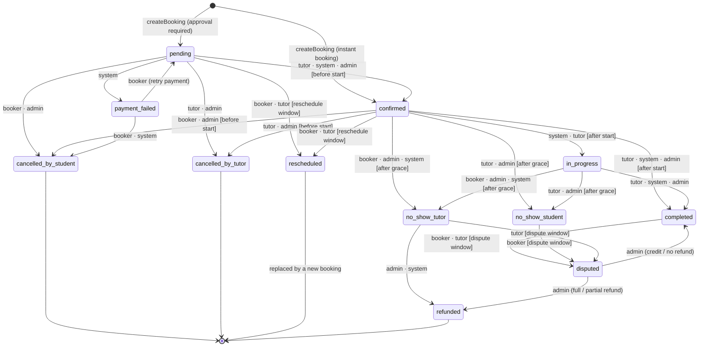
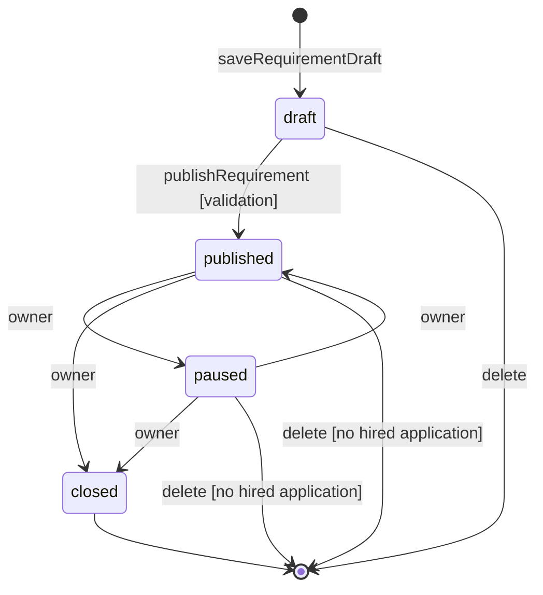
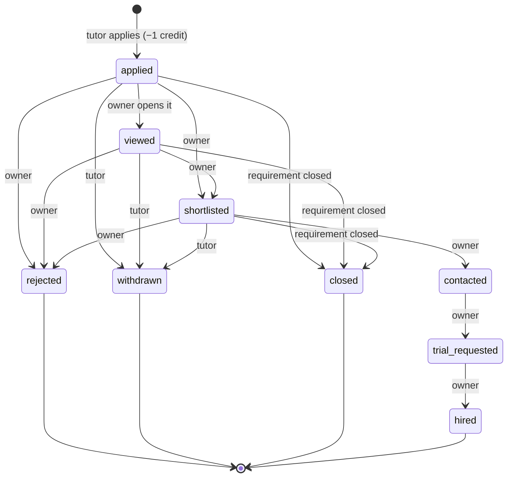
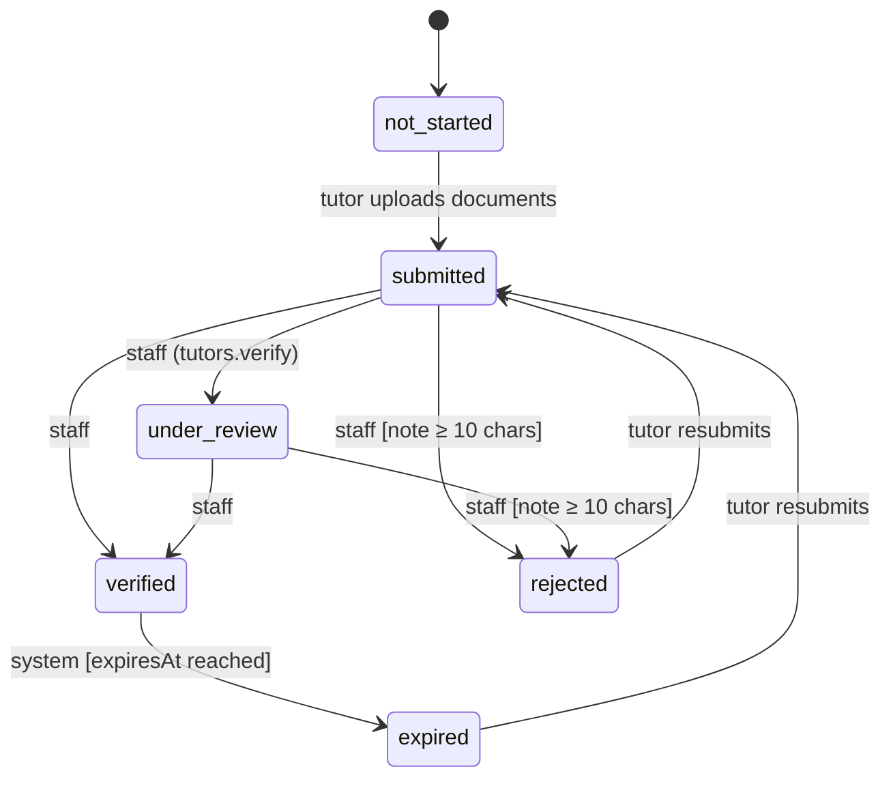
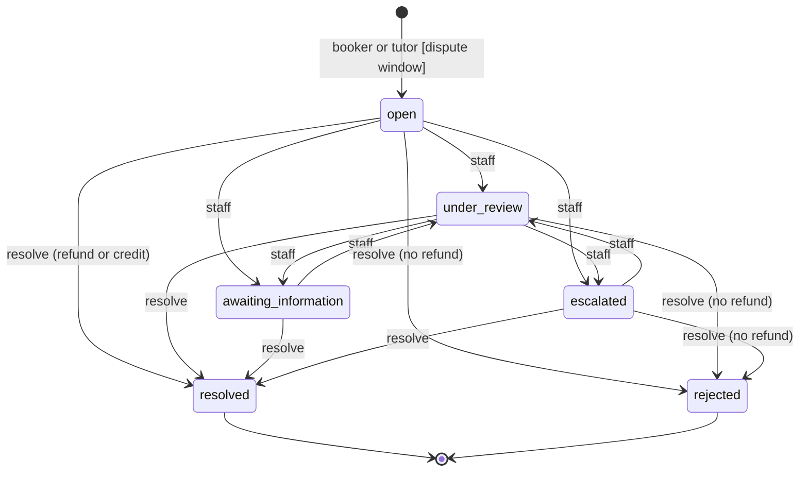
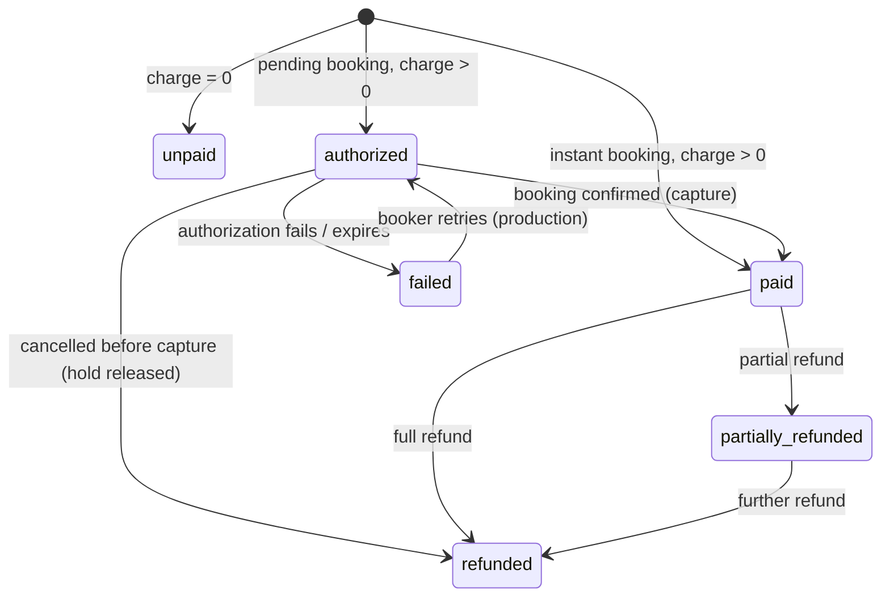
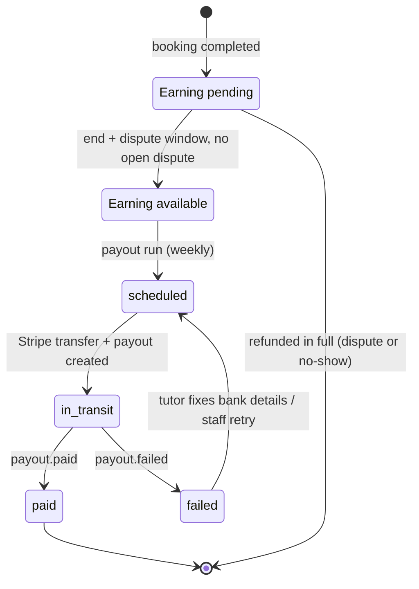
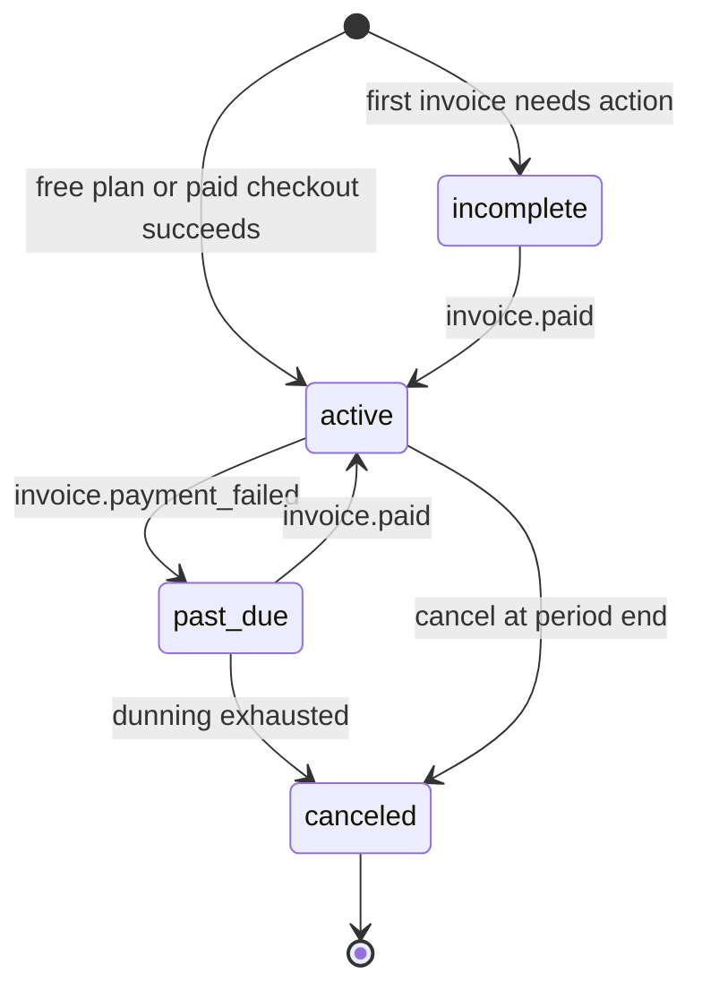

# State machines

Every lifecycle in TutorLink is an explicit state machine. Callers request a transition; the owning module checks the **actor**, the **guard** (time, policy, ownership) and then applies **side effects** atomically. The booking machine below is transcribed from `src/lib/booking.ts` (`TRANSITIONS`, guards, `cancellationRefund`) and the store actions that call it (`createBooking`, `transitionBooking`, `rescheduleBooking`, `openDispute`, `resolveDispute`). In production the same table lives in `BookingsService` and runs inside a database transaction; every transition writes a `booking_events` row.

Policy values below are `DEFAULT_POLICY` (`src/lib/data/platform.ts`) — admin-editable and pending approval in [DECISIONS.md](DECISIONS.md).

| Policy key | Default |
|---|---|
| `freeCancellationHours` | 24 |
| `trialFreeCancellationHours` | 4 |
| `lateCancellationRefundPercent` | 50 |
| `rescheduleMinHours` | 12 |
| `maxReschedulesPerBooking` | 2 |
| `noShowGraceMinutes` | 15 |
| `disputeWindowDays` | 7 |
| `meetingLinkVisibleMinutesBefore` | 15 |
| `studentNoShowRefundPercent` / `tutorNoShowRefundPercent` / `tutorNoShowCreditCents` | 0 / 100 / 1000 (defined, not yet read by the store) |

---

## 1. Booking

### Modeling decision: trial is a type, not a status

`Booking.type` is `"trial" | "regular"`. A trial is an ordinary booking with the tutor's trial price and length, so it flows through exactly the same states, payments, reminders, no-show handling, disputes and reviews. The only trial-specific rules are:

- The `trial_lessons` flag must be on and the tutor's `trial.enabled` true; `durationMin` must equal `trial.durationMin`.
- One trial per tutor per learner (learner = `childId ?? bookerId`), counting any trial that is not `cancelled_*`. Production backs this with a partial unique index.
- The free-cancellation window is `trialFreeCancellationHours` (4 h) instead of 24 h.
- A $0 trial carries `paymentStatus: "unpaid"` and no payment record.

A separate "trial" status would have duplicated every edge of the graph for no behavioural gain.

### Actors

`actorFor(user, booking)` (`src/lib/permissions.ts`):

| Actor | Who |
|---|---|
| `booker` | The account that booked and pays (student or parent) |
| `tutor` | The user whose `tutorId` matches the booking |
| `admin` | Any staff user with `bookings.manage` (Administrator **and** Support by default) |
| `system` | Scheduled jobs and webhooks (production only — nothing fires `system` transitions in the preview) |

### Diagram

### Transition table

| From | To | Actors | Guard | Entry point |
|---|---|---|---|---|
| — | `pending` | booker | Create validations (below) | `createBooking` |
| — | `confirmed` | booker (+ `system` event) | Create validations; tutor `requiresApproval = false` **and** `instant_booking` flag | `createBooking` |
| `pending` | `confirmed` | tutor, system, admin | `beforeStart`: now < start | `transitionBooking` |
| `pending` | `cancelled_by_student` | booker, admin | — | `transitionBooking` |
| `pending` | `cancelled_by_tutor` | tutor, admin | — | `transitionBooking` |
| `pending` | `payment_failed` | system | — | payment webhook (production) |
| `pending` | `rescheduled` | booker, tutor | `canReschedule` | `rescheduleBooking` only |
| `confirmed` | `in_progress` | system, tutor | `afterStart`: now ≥ start | `transitionBooking` ("Start lesson") |
| `confirmed` | `completed` | tutor, system, admin | `afterStart` | `transitionBooking` |
| `confirmed` | `cancelled_by_student` | booker, admin | `beforeStart` | `transitionBooking` |
| `confirmed` | `cancelled_by_tutor` | tutor, admin | `beforeStart` | `transitionBooking` |
| `confirmed` | `rescheduled` | booker, tutor | `canReschedule` | `rescheduleBooking` only |
| `confirmed` | `no_show_student` | tutor, admin | `afterGrace`: now ≥ start + 15 min | `transitionBooking` |
| `confirmed` | `no_show_tutor` | booker, admin, system | `afterGrace` | `transitionBooking` |
| `in_progress` | `completed` | tutor, system, admin | — | `transitionBooking` |
| `in_progress` | `no_show_student` | tutor, admin | `afterGrace` | `transitionBooking` |
| `in_progress` | `no_show_tutor` | booker, admin, system | `afterGrace` | `transitionBooking` |
| `completed` | `disputed` | booker, tutor | `withinDisputeWindow`: now ≤ end + 7 days | `openDispute` only |
| `no_show_student` | `disputed` | booker | `withinDisputeWindow` | `openDispute` only |
| `no_show_tutor` | `refunded` | admin, system | — | `transitionBooking` |
| `no_show_tutor` | `disputed` | tutor | `withinDisputeWindow` | `openDispute` only |
| `payment_failed` | `pending` | booker | — | `transitionBooking` ("Retry payment") |
| `payment_failed` | `cancelled_by_student` | booker, system | — | `transitionBooking` |
| `disputed` | `refunded` | admin | — | `resolveDispute` (full/partial refund); also reachable via `transitionBooking` |
| `disputed` | `completed` | admin | — | `resolveDispute` (credit/no refund); also reachable via `transitionBooking` |

Terminal states: `cancelled_by_student`, `cancelled_by_tutor`, `rescheduled`, `refunded`. Calendar-blocking states (`BLOCKING_STATUSES`): `pending`, `confirmed`, `in_progress`.

`canTransition(b, to, actor, now, policy)` fails with a user-facing reason when the edge does not exist ("A completed booking cannot become pending."), the actor is not listed ("You don't have permission to make this change."), or the guard fails (the guard's own message). `availableTransitions()` drives which action buttons the UI shows (`ACTION_LABEL`).

### Guards

| Guard | Rule | Message |
|---|---|---|
| `beforeStart` | `now < startUtc` | "This lesson has already started." |
| `afterStart` | `now ≥ startUtc` | "Available once the lesson has started." |
| `afterGrace` | `now ≥ startUtc + noShowGraceMinutes` | "No-shows can be reported 15 minutes after the start time." |
| `withinDisputeWindow` | `now ≤ endUtc + disputeWindowDays` | "Disputes must be opened within 7 days of the lesson." |
| `canReschedule` | `now < startUtc − rescheduleMinHours` **and** reschedule count < `maxReschedulesPerBooking`, where count = `rescheduled` events in this booking's history + 1 if `rescheduledFromId` is set | "Lessons can be rescheduled up to 12 hours before the start time." / "This lesson has reached the reschedule limit." |

**Create validations** (`createBooking`): signed-in student or parent; not suspended; parental consent not pending; idempotency key not already used (a retry returns the existing booking); tutor exists; parent must pick one of their own children; tutor teaches the mode and subject; online requires `online_lessons`; trial rules above; `withinAvailability` (minimum notice, maximum advance days, 15-minute alignment, offered session length or trial length); no overlap with a blocking booking ± the tutor's buffer; coupon valid if supplied.

### Side effects

| Transition | Money | Other effects |
|---|---|---|
| create → `pending` | charge = price − discount. charge > 0 ⇒ `paymentStatus: authorized`, payment record `pending` (production: PaymentIntent held with manual capture). charge = 0 ⇒ `unpaid`. | Coupon redemption counted; history event; conversation auto-started; notify booker ("Request sent") and tutor ("New booking request"). |
| create → `confirmed` (instant) | charge > 0 ⇒ `paid`, payment `succeeded` (production: authorize then capture immediately). | As above plus a `system` history event "Instant booking"; notifications say "Lesson confirmed" / "New lesson booked". |
| `pending → confirmed` | charge > 0 ⇒ `paid`; pending payment → `succeeded` (production: **capture**). | Notify booker. Production: create meeting link, schedule reminders and lifecycle timers. |
| `→ cancelled_by_student` / `cancelled_by_tutor` | If `authorized`: hold released (preview records `paymentStatus: refunded`; production cancels the PaymentIntent). Otherwise refund per `cancellationRefund()` as a negative payment line; `paymentStatus` becomes `refunded` or `partially_refunded`. | The refund rule text is appended to the history note; notify the other party. |
| `→ no_show_tutor` | Full refund of the amount paid; `paymentStatus: refunded`. | Notify the other party. |
| `→ no_show_student` | None (policy: 0 % refund). | Notify the booker. |
| `→ completed` | None immediately. Production: tutor earnings become payable after the dispute window. | Notify booker with a review request. |
| `→ rescheduled` | Payment records re-pointed to the new booking. | Old booking becomes terminal `rescheduled`; a **new** booking is created with `rescheduledFromId`, a new meeting URL, idempotency key `{old}_r{n}`, status `confirmed` if the tutor rescheduled or the old booking was confirmed, otherwise `pending`. Availability and overlap are re-checked. Notify the other party. |
| `→ disputed` | None (production: earnings frozen). | `Dispute` record created (details ≥ 30 chars, one open dispute per booking); notify the other party. |
| `disputed → refunded / completed` | Full refund ⇒ `refunded`; partial ⇒ `partially_refunded`; credit ⇒ platform credit (production: `account_credit_entries`); no refund ⇒ unchanged. | Dispute `resolved` (or `rejected` for no refund); audit `dispute.resolve`; notify booker. |
| Any staff (`admin`) transition | — | Audit `booking.transition` with from/to. |
| Every transition | — | History event `{ at, by, from, to, note }`; notification to the counterparty. |

**Refund rule** (`cancellationRefund`): paid = price − discount; nothing charged ⇒ no refund. Cancelled by tutor or staff ⇒ full refund. Cancelled by the booker ≥ free window before start (24 h; 4 h for trials) ⇒ full refund; later ⇒ 50 %. Amounts are integer cents (`percentOf`, rounded half-up).

**Meeting link** (`meetingLinkVisible`): online lessons in `confirmed` or `in_progress`, from 15 minutes before start until the end.

### Gaps to close before production

1. **Unanswered requests.** A `pending` booking that reaches its start time has no outgoing transition (`confirmed` requires `beforeStart`; `system` is not an allowed actor for cancellation). Add a `system` expiry edge (e.g. `pending → cancelled_by_tutor` with note "Request expired", or a dedicated `expired` status) at the earlier of start time and a response deadline, releasing the authorization.
2. **Reschedule limit across chains.** The count only looks one link back (`rescheduledFromId ? 1 : 0`), so a chain A → B → C → … never reaches the limit of 2. Production stores a cumulative `rescheduleCount` on the booking (see schema).
3. **Staff shortcuts.** `transitionBooking` lets an admin move `disputed → refunded/completed` and `no_show_tutor → refunded` without a dispute resolution or refund record. Production routes these through `resolveDispute` / the refunds service only.
4. **Retry payment.** `payment_failed → pending` does not re-authorize (the preview leaves `paymentStatus: failed`). Production creates a new PaymentIntent before moving to `pending`.
5. **Policy fields.** `studentNoShowRefundPercent`, `tutorNoShowRefundPercent` and `tutorNoShowCreditCents` are defined but the store hard-codes 0 % / 100 % and never grants the credit.
6. **Availability re-check.** `createBooking` re-checks notice, alignment, length and overlaps but not that the start falls inside the tutor's weekly windows or outside blocked exception days. Production validates against `generateSlots` output.

---

## 2. Requirement (tutor job)

| Transition | Actor | Guard / effect |
|---|---|---|
| save draft | owner (student/parent) | Owner and status cannot be changed by a draft save; `childId` must be the owner's child; `draftStep` tracks progress. |
| `draft → published` | owner | Subject; title ≥ 8 chars; objectives ≥ 20 chars; ≥ 1 mode; valid 5-digit ZIP when in person; `budgetMax ≥ budgetMin`. Sets `publishedAt` once. Sends `job_match` notifications to tutors with an **instant** jobs saved search for that subject. |
| `published ↔ paused` | owner | Paused jobs are hidden from the job board and do not accept applications. |
| `published/paused → closed` | owner | Terminal. Every application not `hired`, `rejected` or `withdrawn` becomes `closed`. |
| delete | owner | Blocked when any application is `hired` ("Close this requirement instead"). Deletes its applications (production: soft delete). |

Only `published` requirements accept applications. `draft` cannot be paused or closed directly.

---

## 3. Application

As implemented (`applyToJob`, `setApplicationStatus`):

The diagram shows the intended forward path. The store is more permissive:

| Rule | Implementation |
|---|---|
| Apply | Tutor with a profile; requirement `published`; no existing non-withdrawn application; message ≥ 40 chars (masked); rate $10–$500 in whole cents; ≥ 1 lead credit when `lead_credits` is on (1 credit spent). Owner notified. |
| Owner changes | Owner may set `viewed`, `shortlisted`, `contacted`, `trial_requested`, `hired` or `rejected` in **any order** while the application is active. `viewed` only applies from `applied` (idempotent otherwise). Tutor is notified of every change except `viewed`. |
| Tutor changes | `withdrawn` only. |
| Inactive | `withdrawn`, `closed`, `rejected` accept no further changes. `hired` is **not** locked (owner could still reject; tutor could still withdraw). |
| Re-apply | Allowed after withdrawal and spends another credit. Production keeps one row per tutor per requirement and re-opens it. |

Recommendation for production: enforce forward-only order, make `hired` terminal, and decide whether withdrawal or no response refunds the credit ([DECISIONS D5](DECISIONS.md#d5-lead-credits)).

---

## 4. Tutor verification (per check kind)

Kinds: `identity`, `education`, `certification`, `background`. Each kind has its own status on the tutor (`Tutor.verification[kind]`) and a history of `VerificationRequest`s. Badges are shown only for `verified`.

| Rule | Detail |
|---|---|
| Submit | Tutor only; ≥ 1 document; PDF/PNG/JPG/HEIC; ≤ 15 MB each; rejected when the kind is already `submitted`, `under_review` or `verified`. Onboarding with an ID document creates an `identity` request automatically. |
| Review | Requires `tutors.verify` (Administrator by default, not Support). Rejection needs an explanatory note shown to the tutor. `verified` sets `expiresAt` = +730 days. Every decision is audited (`verification.approve / reject / start_review`) and the tutor is notified. |
| Expiry | Production-only scheduled job; the preview never sets `expired`. |
| Background | Production integrates a vendor (FCRA consent, adverse-action flow); result arrives by webhook. |

---

## 5. Dispute

| Rule | Detail |
|---|---|
| Open | Only the booker or tutor, only where the booking machine allows `→ disputed` (see §1), details ≥ 30 chars, one open dispute per booking. Reasons: `missed_session`, `tutor_no_show`, `student_no_show`, `service_issue`, `payment_issue`, `refund_issue`, `other`. Evidence files optional. |
| Work | `disputes.manage` (Support and Administrator). Internal notes and status changes are audited. The preview allows any status except `resolved` via `setDisputeStatus`, **including on closed disputes** — production must reject changes once `resolved`/`rejected`. |
| Resolve | `full_refund` (amount = paid), `partial_refund` (0 < amount ≤ paid), `credit` (platform credit, may exceed paid), `no_refund` → dispute `rejected`. Refund outcomes also require `payments.refund`. Note ≥ 10 chars. Booking → `refunded` (refund outcomes) or `completed` (credit / no refund). Audited; booker notified. |

---

## 6. Payment

Booking-level `paymentStatus` (as the store sets it):

Payment-record lifecycle in production (maps 1:1 to the Stripe PaymentIntent):

| `payments.status` | Stripe PaymentIntent status | Meaning |
|---|---|---|
| `pending` | `requires_payment_method`, `requires_confirmation`, `requires_action`, `processing` | Checkout in progress (3-D Secure may be required) |
| `requires_capture` | `requires_capture` | Authorized, held for up to ~7 days |
| `succeeded` | `succeeded` | Captured |
| `canceled` | `canceled` | Hold released (declined, cancelled before capture, authorization expired) |
| `failed` | `requires_payment_method` after a failure | Card declined / authentication failed → booking `payment_failed` |
| `refunded` / `partially_refunded` | — (derived from `charge.refunded`) | `amountRefundedCents` = sum of succeeded `refunds` |

Refund records move `pending → succeeded | failed | canceled` from `charge.refunded` / `refund.updated` webhooks. Chargebacks (`charge.dispute.created`) open an internal dispute and freeze the tutor's unpaid earnings for that booking.

---

## 7. Payout

| Rule | Detail |
|---|---|
| Earning | `tutorEarningsCents = charge − platform commission` (commission basis in [DECISIONS D3](DECISIONS.md#d3-platform-fee-and-commission)). Created when the booking completes (or is resolved as `completed`). |
| Availability | After `endAt + disputeWindowDays` (7 days) with no open dispute or chargeback. Partial refunds after payout create a negative `adjustment` item in the next payout. |
| Payout run | Weekly job groups available earnings per tutor with `payoutsEnabled`; creates a Stripe transfer (separate charges and transfers) with an idempotency key per payout; `payout_items` link each booking. |
| Failures | `payout.failed` → `failed`, tutor notified to update bank details in the Connect dashboard; retry requires `payouts.manage` or happens automatically once the account is fixed. |

Preview payouts are static sample rows (`scheduled`, `in_transit`, `paid`) — no earning-availability logic runs.

---

## 8. Subscription (tutor plans)

Preview `changePlan` switches immediately, records a payment for paid plans and grants that plan's monthly credits each time it is called (no proration, no recurring grant). Production grants credits on each `invoice.paid` for the billing period and prorates plan changes through Stripe Billing.
